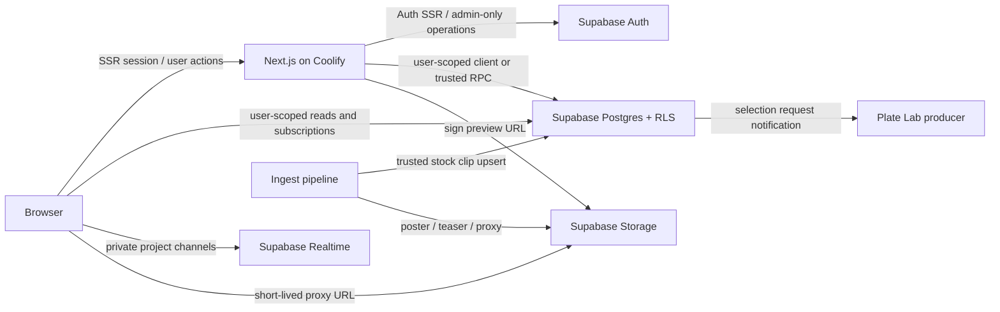

# The Plate Lab User Features on Supabase

**Status:** In implementation
**Date:** 2026-07-29
**Last implementation update:** 2026-07-30
**Product source:** `THE_LAB_PRODUCT_PLAN.md` supplied by Andy Roberts
**Applies to:** `meridian_public_site`

## Implementation status

Completed on `agent/supabase-user-features`:

- Supabase Auth SSR, email/Google entry points, project onboarding, project
  dashboard, and scene creation.
- Identity/project migrations, RLS access matrix, generated database types,
  and staging migration tooling.
- Canonical stock clip, asset, descriptor, segment, embedding-job, vector, and
  scene-selection schema.
- Idempotent import and exact reconciliation of all eight current JSON catalog
  records.
- Supabase-backed public catalog reads, trusted ingest writes, and admin
  draft/live actions.
- Full-text search across clip metadata, extensible descriptors, and segments.
- pgvector HNSW search and reciprocal-rank fusion, with OpenAI query/ingest
  embedding workers and lexical fallback.
- Persistent add-to-scene and scene-clip status transitions with version
  checks.

Still required for the staging release:

- Apply the catalog migration and importer to staging.
- Give the OpenAI Platform project API quota, then process the 16 queued
  initial embeddings.
- Set the web and ingest Coolify variables and restart both resources.
- Complete the staging smoke checks in
  `docs/runbooks/catalog-supabase-cutover.md`.

Later phases remain open for invitations, notes, Realtime collaboration,
selection submission/producer workflow, signed private LAB media, and the
integrated LAB viewer.

## 1. Outcome

Build the authenticated customer workspace described in THE LAB plan without
turning The Plate Lab into an ecommerce or production-file delivery platform.

The release should let a client:

1. Sign in and work inside an organization.
2. Create a project and scenes.
3. Search the stock catalog from a scene brief.
4. Add a stock clip to a scene once and see one synchronized status everywhere.
5. Review the clip in THE LAB with an approved mapping profile.
6. Save notes, in/out points, vehicle choice, and creative camera framing.
7. Invite collaborators or selected-clips-only reviewers.
8. Submit selected clips to a Plate Lab producer for a quote, PO, licensing, and
   offline delivery follow-up.

The release will **not**:

- collect or process money;
- implement a shopping cart or payment checkout;
- host or deliver production-size masters to clients;
- create anonymous review links;
- replace a production company's preferred delivery service.

## 2. Decisions That Change the Original Plan

### 2.1 Replace commerce with a producer handoff

The terminal customer action is **Submit selections to producer**, not
checkout. Submission creates an immutable request containing the project,
scene, stock clip, source range, duration tier, license request, production
contact, and optional PO/reference information.

A producer handles price, PO, contract, billing, and delivery outside this
system. The application records workflow status only:

`draft -> submitted -> acknowledged -> licensed -> closed`

The scene clip itself uses:

`considering -> selected_for_quote -> rejected -> submitted_for_quote`

Rejection is reversible. A submitted request is a snapshot; later scene edits
do not rewrite the historical request.

The current unauthenticated 72-hour JSONL reservation endpoint should be
retired. Do not imply that a clip is held until a producer explicitly confirms
a hold. If holds become necessary later, add a producer-controlled
`clip_holds` table with an expiration time.

### 2.2 Keep production media out of Supabase Storage

Supabase Storage is for:

- public posters and small watermarked teasers;
- private, watermarked LAB preview proxies;
- optional avatars or organization marks.

Production masters and camera originals remain outside the browser and outside
the MVP Storage buckets. A producer coordinates the final delivery destination
case by case.

### 2.3 Keep the public storefront

The current home, browse, and public plate-detail pages remain useful acquisition
surfaces. Authentication becomes required when a visitor:

- creates or opens a project;
- adds a clip to a scene;
- opens the integrated LAB;
- reads an invited project or selected-clips review;
- submits selections to a producer.

Public catalog access can show posters and short watermarked teasers. The longer
LAB proxy is private and delivered through a short-lived signed URL.

### 2.4 One `SceneClip` is the shared state boundary

Create a unique database relationship for `(scene_id, stock_clip_id)`. Search
results, the scene workspace, and THE LAB all read and mutate this record. Do
not keep independent shortlist, viewer, and quote copies.

## 3. Current-State Findings

| Area | Current implementation | Required change |
| --- | --- | --- |
| Frontend | Next.js 15 App Router, React 19, Coolify deploy | Keep it |
| Catalog | `web/data/catalog.json`, read from local disk | Move catalog records to Postgres |
| Ingest publish | Atomic JSON rewrite with a lockfile | Upsert through a trusted DB repository |
| Public media | Files under `web/public/media` | Split public teasers from private LAB proxies |
| Customer auth | None | Supabase Auth with SSR cookies |
| Admin auth | One shared password/HMAC cookie | Migrate staff identity to Supabase roles after customer auth is stable |
| Projects/scenes | None | New Supabase schema and routes |
| Reservations | Anonymous JSONL append | Replace with authenticated selection submission |
| Viewer | Static iframe; local file/URL loading; camera views in `localStorage` | Integrate with `SceneClip`, signed media, and mapping profiles |
| Search | Client-side filtering over all JSON | Postgres hybrid search RPC plus structured filters |
| Collaboration | None | RLS, invitations, notes, and Realtime |

Runtime JSON migration includes more than the public catalog. Treat each file
domain separately:

- `catalog.json`: migrate in the first database cutover.
- `reservations.jsonl`: archive; do not import as real orders unless a producer
  identifies an active commitment.
- transfer-state JSON and SKU ledger: migrate in a later ingest-operations
  workstream so customer launch is not coupled to daemon refactoring.
- audit JSONL and stitch-report metadata: backfill to database audit/artifact
  records later; keep large report files in object/file storage.

## 4. Target Architecture



### Application boundary

Use Supabase as the data and identity platform, not as a replacement for the
Next.js application:

- **Browser Supabase client:** authenticated, publishable key, always subject to
  RLS; used for user-scoped reads, optimistic mutations, and Realtime.
- **Next.js server Supabase client:** cookie-backed user client for Server
  Components, Server Actions, and Route Handlers.
- **Trusted server client:** secret key only in Coolify and the ingest daemon;
  used for invitation delivery, account administration, preview signing,
  embedding jobs, and ingest. Never expose it to browser code.
- **Postgres functions/RPC:** atomic status/range transitions, invitation
  acceptance, hybrid search, and submission snapshots.
- **Edge Functions:** not required for MVP. Keeping privileged orchestration in
  the existing Next.js/pipeline runtimes avoids an additional deployment
  surface. Add Edge Functions later only where isolation or background execution
  is materially useful.

The currently recommended `@supabase/ssr` package is still documented as beta.
Pin its exact version and keep all client/cookie setup behind the three local
Supabase wrappers so an SDK change does not spread through application code.

## 5. Supabase Technology Choices

| Need | Supabase technology | Use |
| --- | --- | --- |
| Login, logout, recovery, sessions | Auth (GoTrue) + `@supabase/ssr` | Email/password first; verified email required |
| Tenant and project authorization | Postgres RLS | Enforce access in the database, not only in React |
| Application API | PostgREST plus RPC | Ordinary CRUD through generated APIs; critical transitions through functions |
| Catalog and workflow state | Postgres | Single source of truth |
| Search | `tsvector` + `pgvector` hybrid RPC | Exact metadata plus semantic scene-brief matching |
| Notes/status synchronization | Realtime Broadcast on private project topics | Database-triggered events, no live presence in MVP |
| Preview protection | Private Storage bucket + signed URLs | Watermarked proxies only |
| Public discovery media | Public Storage bucket | Posters and short watermarked teasers |
| Connection management | Supavisor | Pipeline/server DB connections if using direct SQL |
| Types | Generated TypeScript database types | Checked into the repo and regenerated with migrations |
| Schema changes | Versioned SQL migrations | Source controlled; never make production-only Studio edits |

Supabase Auth requires production SMTP in the self-hosted stack. Configure TLS,
public/Auth URLs, site URL, allowed redirects, sender identity, password recovery
templates, and invitation templates before implementing UI.

## 6. Proposed Database Model

Use UUID primary keys, `created_at`, `updated_at`, and soft-archive timestamps
where the product calls for recovery. Use database enums or constrained text for
stable workflow values. Store frame positions as integers, not floating-point
seconds.

### Identity and tenancy

#### `profiles`

- `id` references `auth.users`
- `display_name`
- `avatar_path`
- timestamps

Auth remains the source of truth for email. Do not copy editable role or
authorization claims into `user_metadata`.

#### `organizations`

- `id`, `name`, `slug`
- `created_by`
- timestamps

#### `organization_memberships`

- `organization_id`, `user_id`
- `role`: `owner | member`
- `status`
- timestamps
- unique `(organization_id, user_id)`

Do not place one `organization_id` directly on the user. A normalized membership
table costs little and prevents a future multi-company migration.

#### `staff_users`

- `user_id`
- `role`: `producer | catalog_admin | system_admin`

This table, protected by RLS and helper functions, controls staff-only mapping,
catalog, and request-management operations.

### Project access

#### `projects`

- organization, creator, name, client, production, description, due date
- `status`: `active | archived`
- production approach and stage/custom-stage fields
- `last_activity_at`, timestamps

Database checks enforce valid combinations:

- a listed stage requires `stage_profile_id`;
- a custom stage requires `custom_stage_name`;
- undecided/VFX does not carry a listed stage.

#### `project_memberships`

- `project_id`, `user_id`
- `role`: `owner | collaborator | reviewer`
- `scope`: `full_project | selected_clips_only`
- `invitation_id`, timestamps
- unique `(project_id, user_id)`

Owners always have `full_project` scope. Selected-clips reviewers cannot read
scene briefs, searches, rejected clips, or unselected clips.

#### `project_invitations`

- project, invited email, inviter
- role and scope
- SHA-256 token hash, expiration, accepted/revoked timestamps
- resend/replacement metadata

Project invitations are application records, distinct from Supabase Auth user
invitations. The acceptance flow:

1. Verify the project invitation token.
2. Require sign-in or account creation.
3. Compare the verified Auth email with the invited email.
4. Atomically create/update project membership and mark the invitation accepted.
5. Audit the event.

This works identically for existing and new users and allows a product-specific
invitation lifetime. Store only the token hash.

### Catalog and LAB setup

#### `stock_clips`

Normalize the current catalog contract into typed columns:

- immutable public SKU and MMM stock clip ID;
- title, description, shoot/rig fields;
- location, weather, time, season, movement, road/shot type;
- frame count, rational frame rate, source start timecode;
- resolution, format, color, camera-original description;
- tags and detected objects;
- visibility and availability;
- searchable text, keyword vector, semantic embedding/model;
- timestamps.

Preserve the current SKU as the public clip ID. Add a separate UUID primary key.
Represent frame rate as numerator/denominator (for example `24000/1001`), not
the approximate `23.98`, so timecode and range math remain deterministic.

#### `stock_clip_assets`

- stock clip, asset role, bucket, object path
- MIME type, bytes, checksum, dimensions, duration/frame count
- access class: `public | authenticated_preview | staff_only`
- timestamps

No production master object path is exposed through customer-facing views.

#### `stage_profiles`

- name, location, stage type, dimensions/capabilities JSON
- LAB replica key and replica availability
- active flag and timestamps

#### `mapping_profiles`

- stock clip, version, projection type
- wall/ceiling crop and alignment values
- approval status, approver, approved timestamp
- schema version and timestamps

Clients can read only the current approved profile. Staff can create versions
and approve one. A published clip should have an approved profile before it is
eligible for THE LAB.

### Customer workflow

#### `scenes`

- project, scene number/name, sort order
- search brief and notes
- production approach/stage overrides
- vehicle type and rough shot type
- structured filters JSON
- status, archived timestamp, version, timestamps

#### `scene_clips`

- scene and stock clip
- status
- rank/source of addition
- in/out frames and duration tier
- vehicle override
- camera preset and versioned `camera_state` JSON
- client trim and versioned `viewer_state` JSON
- added by, archived timestamp, optimistic-lock version, timestamps
- unique `(scene_id, stock_clip_id)`

Canonical staff mapping does not live in `scene_clips`. Only client creative
state and an optional minimal trim live there.

#### `notes`

- scene clip, author, body
- optional source frame
- edited/deleted timestamps

Use soft deletion so review context remains auditable.

#### `selection_requests`

- project, submitter, production contact
- status, message, optional PO/reference text
- submitted/acknowledged/closed timestamps

#### `selection_request_items`

- request, scene clip, stock clip
- snapshot of scene name, SKU, in/out frames, duration tier
- requested license/delivery notes
- producer status/notes

These are request snapshots, not cart line items and not entitlements.

#### `audit_events`

- actor, organization, project, entity type/id
- event type
- safe before/after or event payload
- request/correlation ID and timestamp

Audit invitations, membership changes, status/range changes, mapping approvals,
availability changes, and producer submissions. Do not place secrets or signed
URLs in event payloads.

## 7. Authorization Model

Enable RLS on every exposed table. The publishable key is safe only when the
policies are correct.

Create indexed helper functions in a non-exposed `private` schema:

- `is_org_member(org_id)`
- `has_full_project_access(project_id)`
- `can_manage_project(project_id)`
- `can_review_selected_clip(scene_clip_id)`
- `is_staff(required_role)`

Set an explicit empty/safe `search_path` on security-definer functions and
grant execute only to intended roles.

### Access matrix

| Resource | Public | Full project member | Selected-only reviewer | Staff |
| --- | --- | --- | --- | --- |
| Live stock clip metadata | Read | Read | Read for shared selections | Manage by role |
| Project/scene/search brief | None | Read/write by role | None | Support access only by policy |
| Selected review projection | None | Read | Read selected items only | Read |
| Scene clip status/range | None | Collaborator write; reviewer read | Read; optionally note only | Producer read |
| Notes | None | Read; collaborators write | Read/write only on selected items if enabled | Read |
| Approved mapping | None or live-preview subset | Read | Read for selected clips | Version/approve |
| Selection request | None | Owner/collaborator create/read | None | Manage |
| Audit events | None | Owner reads project-safe events if desired | None | Read by role |

Do not give selected-only members raw access to `projects`, `scenes`, or all
`scene_clips`. Expose a whitelisted `selected_review_items(project_id)` RPC that
checks membership and returns only project display fields, scene labels,
selected clips, permitted notes, and ranges.

Critical state changes should be RPCs rather than arbitrary row updates:

- `set_scene_clip_status(id, next_status, expected_version)`
- `set_scene_clip_range(id, in_frame, out_frame, tier, expected_version)`
- `accept_project_invitation(raw_token)`
- `submit_selection_request(project_id, expected_versions[])`

Each function validates authorization and state, updates the version, writes an
audit event, and emits a private Realtime event in one transaction.

## 8. Search Plan

Start with hybrid Postgres search rather than adding a separate search service.

1. Build a weighted generated search document from title, description,
   location, tags, objects, motion, weather, road type, and staff descriptors.
2. Store a `tsvector` with a GIN index for exact/keyword matches.
3. Store a `pgvector` embedding with an HNSW index.
4. Implement an RRF-style `search_stock_clips` RPC that combines keyword and
   semantic rank, then applies availability and structured scene filters.
5. Return match evidence from metadata (for example, location, weather, road
   type, and semantic-description match). Do not generate an LLM explanation
   for every result in MVP.
6. Generate clip embeddings during ingest/metadata updates. Generate the query
   embedding in a Next.js server route.
7. If the embedding provider fails, return full-text results with a visible
   degraded-search indicator.

The first database release may ship full-text search before semantic ranking,
but the schema and RPC contract should support both so UI work is not repeated.

## 9. Media Plan

Create:

- `catalog-public`: posters and short, heavily watermarked teaser proxies.
- `lab-previews`: private full-length watermarked preview proxies.

THE LAB requests a preview grant from a Next.js route. The route verifies the
session and project/scene-clip access, then creates a short-lived signed Storage
URL. Never persist signed URLs in the database or logs.

Use progressive MP4 for the first pilot because the current assets and viewer
already support it. Confirm seeking and HTTP range behavior on the deployed
Storage path. Add HLS only if field testing shows startup, seeking, or long-clip
performance requires it.

If self-hosted Storage uses local disk, back up its object volume separately.
Database backups contain Storage metadata, not the objects themselves. An
S3-compatible backend can be introduced without changing the database object
paths.

## 10. Route and Screen Map

```text
/login
/forgot-password
/auth/callback
/invite/[token]

/projects
/projects/new
/projects/[projectId]
/projects/[projectId]/settings
/projects/[projectId]/sharing
/projects/[projectId]/scenes/[sceneId]
/projects/[projectId]/selections
/projects/[projectId]/review

/lab/[sceneClipId]

/producer/selection-requests
/producer/selection-requests/[requestId]
```

Keep `/`, `/browse`, and `/plate/[sku]`. Add an authenticated **Add to scene**
action to public cards/details and an **Open in THE LAB** action for scene clips.

## 11. Migration and Cutover

### Repository setup

Add:

```text
supabase/
  migrations/
  seed.sql
  tests/
web/lib/supabase/
  browser.ts
  server.ts
  admin.ts
shared/src/database.types.ts
pipeline/src/catalog/
  repository.ts
  jsonRepository.ts
  supabaseRepository.ts
```

Add environment variables through Coolify:

- public Supabase URL and publishable key;
- server-only secret key;
- SMTP is configured in the Supabase stack, not exposed to the browser;
- embedding-provider key only if semantic search is enabled.

### Catalog cutover procedure

1. Create migrations, RLS, generated types, and seed data in a non-production
   database.
2. Build an idempotent importer that parses the existing Zod catalog and
   upserts stock clips and assets by SKU.
3. Import a production catalog snapshot into staging.
4. Reconcile record counts, SKUs, checksums, assets, durations, status, and
   public page output.
5. Add a catalog repository interface to the web and pipeline.
6. Run database reads in staging while production remains on JSON.
7. Schedule a short ingest freeze.
8. Run a final import, switch both web reads and ingest writes to Supabase, and
   deploy together.
9. Export a read-only JSON snapshot for rollback. Do not dual-write both stores
   during normal operation.
10. Remove the JSON writer after one stable release.

The admin draft/live workflow must switch in the same cutover as the pipeline,
otherwise the two catalog writers will diverge.

## 12. Phased Delivery

Estimates assume one experienced full-stack engineer with timely product/design
review. They are planning ranges, not commitments.

### Phase 0 — self-hosted readiness (2–4 days)

- Confirm public HTTPS URL, DNS, Auth callback paths, site URL, and redirect
  allowlist.
- Confirm current Docker image versions and pin them.
- Confirm the installed Postgres image exposes `vector` and the installed
  Realtime version supports authorized private Broadcast; use filtered Postgres
  Changes for the pilot if Broadcast is unavailable.
- Configure production SMTP and test signup, confirmation, invitation, and
  recovery mail.
- Verify Auth, REST, Realtime, Storage, and database health.
- Establish automated Postgres backups, Storage-object backups, monitoring, and
  an off-host restore destination.
- Perform and document one restore drill.
- Add development/staging Supabase environments; do not develop against the
  only production database.

**Exit gate:** a test account can authenticate through the deployed Next.js app,
private Storage signing works, Realtime connects, and a backup can be restored.

### Phase 1 — database foundation and catalog cutover (1–2 weeks)

- Add migrations, generated types, RLS helpers, staff roles, and audit events.
- Create stock clip, asset, stage, and mapping tables.
- Import and reconcile current catalog JSON.
- Move public catalog reads and trusted ingest writes to Supabase.
- Create public/private Storage buckets and migrate representative proxies.
- Keep existing public pages visually unchanged.

**Exit gate:** production catalog behavior matches the current site, a new ingest
appears in Postgres, and no catalog writer relies on JSON.

### Phase 2 — accounts, organizations, projects, and scenes (1–2 weeks)

- Add Supabase SSR auth, login/logout/recovery/callback routes.
- Build profile/org bootstrap.
- Build project dashboard, project settings, stage choice, and scene CRUD.
- Add archive/restore and autosave with optimistic version checks.
- Keep public browse usable without authentication.

**Exit gate:** an authenticated pilot user can create and reopen a project and
scene on another device without seeing another organization's data.

### Phase 3 — shortlist, notes, sharing, and search (1–2 weeks)

- Add scene clips and one synchronized status model.
- Add scene-aware catalog results and structured filters.
- Add full-text search; enable hybrid semantic rank when embedding service is
  ready.
- Add general/timecoded notes.
- Add private Realtime project channels.
- Implement full-project and selected-clips-only invitations and review RPC.
- Add Undo for rejection and explicit autosave/error states.

**Exit gate:** owner, collaborator, and selected-only reviewer pass the access
matrix, and status/note changes appear across permitted sessions.

### Phase 4 — integrated THE LAB (2–3 weeks)

- Refactor the monolithic viewer into projection, stage, vehicle, camera,
  transport, capture, and application-state modules.
- Replace the iframe/local file picker with `/lab/[sceneClipId]`.
- Load the signed catalog proxy and approved mapping automatically.
- Apply project/scene stage, vehicle, and rough camera defaults.
- Persist saved creative camera and minimal client trim to `scene_clips`.
- Keep staff mapping controls behind a staff role.
- Add transport, source timecode, frame step, and 60/120-second range rules.
- Add loading/decode/WebGL error states and branded screenshot download.
- Optimize vehicle assets and avoid unnecessary reflection renders.

**Exit gate:** a user can move between two scene clips, save a camera view, set a
valid range, add a note, reject/select, refresh, and see identical state.

### Phase 5 — producer submission (about 1 week)

- Build project selection summary.
- Validate availability, required ranges, duration tiers, and production contact.
- Submit an immutable selection request.
- Notify producers and add the producer request queue.
- Let producers acknowledge, annotate, mark licensed, and close.
- Remove/redirect the demo reserve and `mailto:` licensing actions.

**Exit gate:** a producer receives a complete, auditable request and can continue
the PO/licensing/delivery process offline without re-keying clip/range data.

### Phase 6 — hardening and private pilot (about 1 week)

- Add RLS/security tests, integration tests, and browser tests.
- Test Chrome, Safari, and Edge on representative hardware.
- Test expired invitations, revoked access, signed URL expiry, network recovery,
  video decode failure, and WebGL failure.
- Complete keyboard/accessibility review and desktop capability checks.
- Add error monitoring and product-event reporting.
- Pilot with a small number of real clients before broad availability.

**Exit gate:** no critical authorization findings, restore/rollback procedures
are exercised, and pilot users complete the vertical slice without staff
workarounds inside the application.

## 13. First Vertical Slice

The first end-to-end milestone should be:

1. A staff-invited owner signs in.
2. The owner creates one project and one scene.
3. The owner searches the real migrated catalog.
4. The owner adds two clips to the scene.
5. The owner invites a selected-clips-only reviewer.
6. THE LAB loads each clip from a signed private proxy with its approved mapping.
7. The owner saves a camera, adds a note, sets a 60-second range, rejects one
   clip, and selects the other.
8. The reviewer sees only the selected clip and permitted notes.
9. The owner submits the selection.
10. A producer sees a complete request and acknowledges it.

This proves identity, RLS, catalog migration, media authorization, viewer
integration, collaborative state, and producer handoff before expanding search
intelligence or staff calibration tools.

## 14. Test Strategy

### Database and security

- Migration-up/down or forward-fix validation in disposable databases.
- pgTAP/SQL tests for every RLS role/scope combination.
- Tests that selected-only users cannot infer scene briefs or unselected IDs
  through REST, RPC, Realtime, Storage, counts, or error differences.
- State-machine and optimistic-lock tests.
- Invitation replay, expiry, revoked membership, and email-mismatch tests.
- Submission snapshot and audit tests.

### Application

- Unit tests for rational frame rate, drop/non-drop timecode, duration tiers,
  and mapping serialization.
- Integration tests for auth callbacks, signed media grants, search fallback,
  and producer submission.
- Playwright tests for the full vertical slice.
- Viewer visual tests for mapping, stage fallback, vehicles, saved cameras, and
  screenshot overlays.

### Migration and operations

- Catalog reconciliation script with a non-zero exit on mismatch.
- Backup and restore drills for Postgres and Storage objects.
- Rollback test from Supabase reads to the frozen JSON export.
- Load test search, signed media grants, and Realtime at pilot-scale concurrency.

## 15. Recommended MVP Cuts

Ship:

- email/password auth and recovery;
- staff-invited pilot owners;
- multiple organizations in schema, even if most users have one;
- project/scene CRUD and archive/restore;
- owner/collaborator/reviewer roles;
- selected-only sharing;
- full-text search with semantic ranking when ready;
- one stage replica and neutral fallback;
- three vehicles and existing locked views;
- saved camera, notes, status, screenshot, and 60/120 ranges;
- producer selection requests;
- desktop editing, mobile read-only/deferred.

Defer:

- public self-service organization creation;
- project duplication and complex batch clip operations if schedule is tight;
- presence indicators, mentions, replies, and note resolution;
- cloud recordings;
- multiple stage replicas;
- client-accessible advanced mapping;
- HLS unless progressive MP4 fails pilot requirements;
- production delivery integrations;
- payment, checkout, entitlements, and accounting.

## 16. Product Defaults to Confirm

Recommended defaults are included so implementation can begin without reopening
the architecture:

1. **Pilot onboarding:** Plate Lab staff invite project owners; owners invite
   collaborators/reviewers.
2. **Reviewer permissions:** selected-only reviewers can read and add notes to
   selected clips but cannot change selection, range, or viewer setup.
3. **Invitation lifetime:** seven days, resend invalidates the previous token.
4. **Session method:** verified email/password with recovery; add magic link
   after SMTP deliverability is proven.
5. **Availability:** selection does not create an automatic hold.
6. **Producer action:** submission generates a queue item and email notification.
7. **Preview transport:** progressive MP4 for pilot.
8. **Search rollout:** full-text fallback is always available; semantic search is
   additive.
9. **Client mapping:** creative camera framing is saved; canonical projection
   mapping remains staff-owned.
10. **Range behavior:** a source shorter than a tier is not silently padded;
    the UI explains the limitation and requires producer review.

The only operational information required before Phase 0 is the Supabase public
endpoint, current Docker image versions, SMTP status, backup destination, and a
staging strategy. No secret values should be committed to this repository.

## 17. Reference Documentation

- [Self-hosting Supabase with Docker](https://supabase.com/docs/guides/self-hosting/docker)
- [Supabase SSR authentication](https://supabase.com/docs/guides/auth/server-side)
- [Row Level Security](https://supabase.com/docs/guides/database/postgres/row-level-security)
- [Private Storage buckets](https://supabase.com/docs/guides/storage/buckets/fundamentals)
- [Realtime database changes](https://supabase.com/docs/guides/realtime/subscribing-to-database-changes)
- [Hybrid search with full text and pgvector](https://supabase.com/docs/guides/ai/hybrid-search)
- [Supabase Auth user invitations](https://supabase.com/docs/guides/auth/users)
